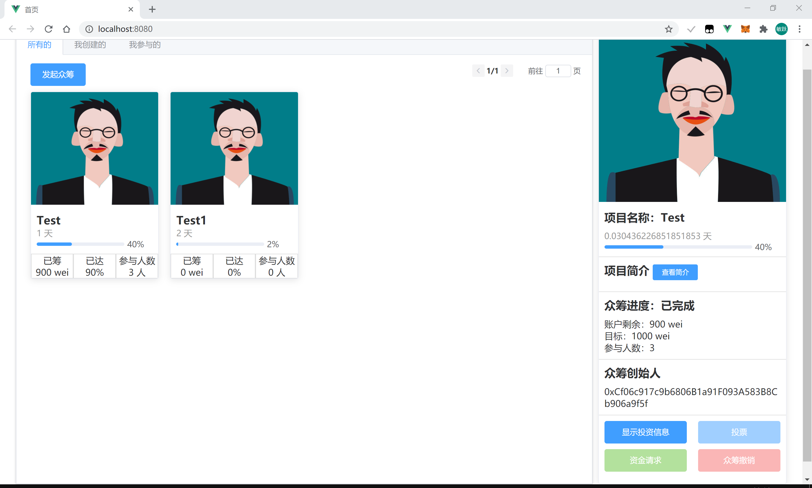
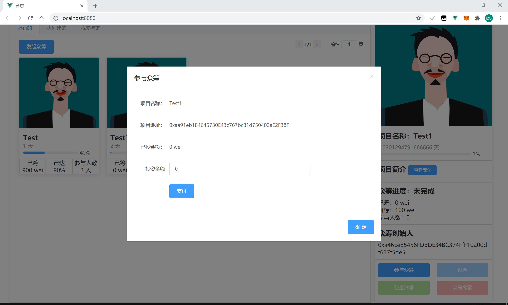
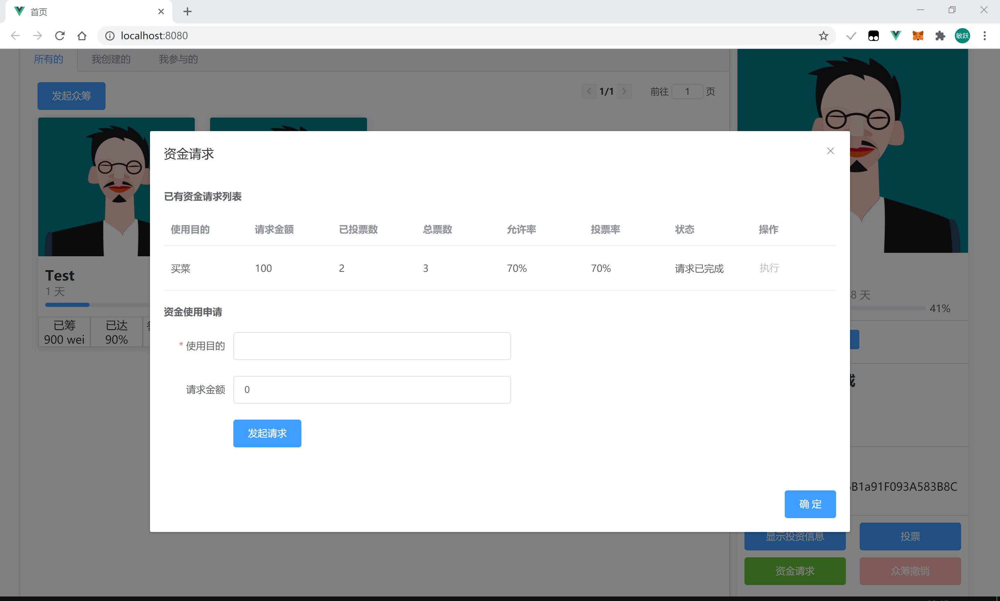
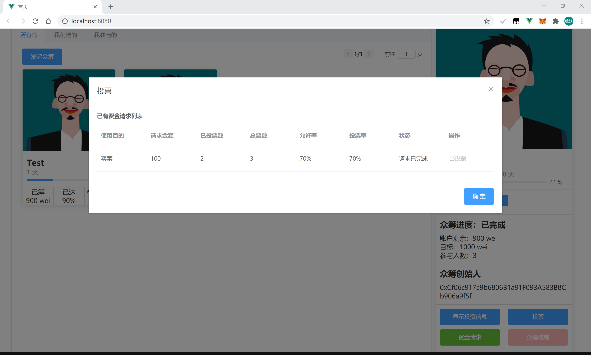

# 去中心化众筹Dapp

[TOC]

## 项目部署方法

### 智能合约部署

1. 复制contracts文件夹下的Funding.sol到remix中

   

2. solidity编译器版本选择v0.5.16, 编译Funding.sol

   

3. MetaMask连接到本地私链

4. 在remix中将FundingFactory合约部署到私链

   

5. 查看新部署合约的地址（可以直接在私链中新创建的区块中查看）

6. 修改`src/eth/fundingInstance.js` 中的合约地址

   

### Vue前端部署

在根目录下（与package.json同目录下）执行以下操作

1. 运行`npm install`
2. 运行`npm run serve`

## 备注

作者：唐敏跃 3180104412

部分合约代码参考自：https://github.com/liucuncong/Funding-eth

前端代码由我独立完成